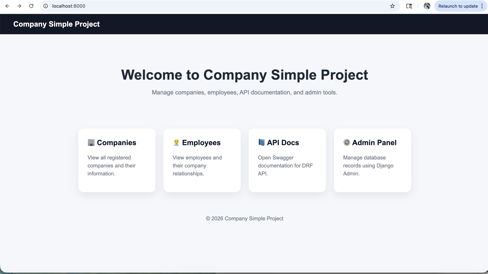
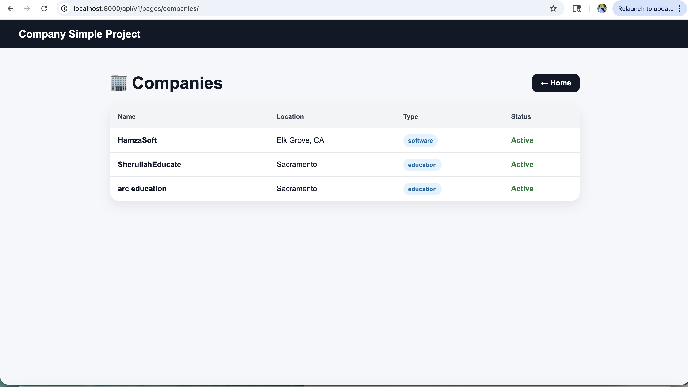
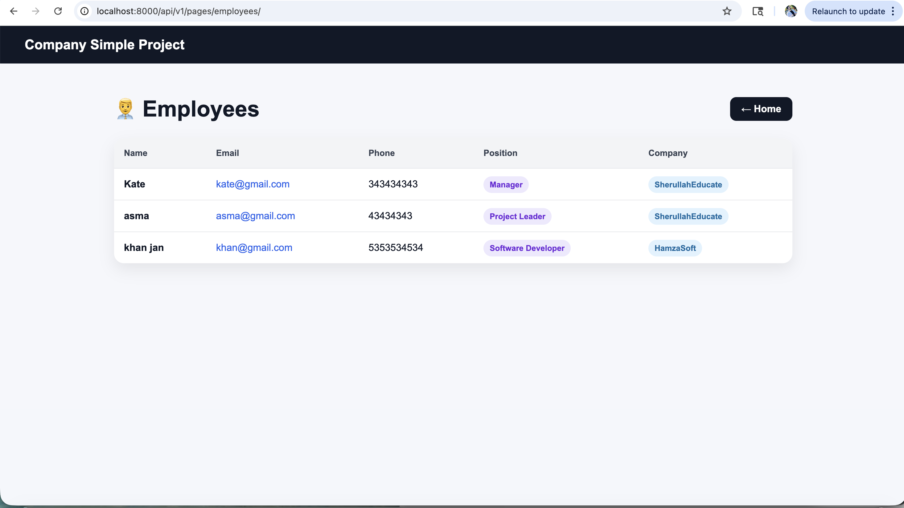
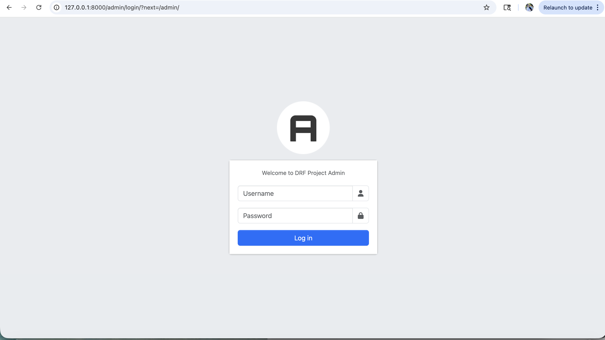
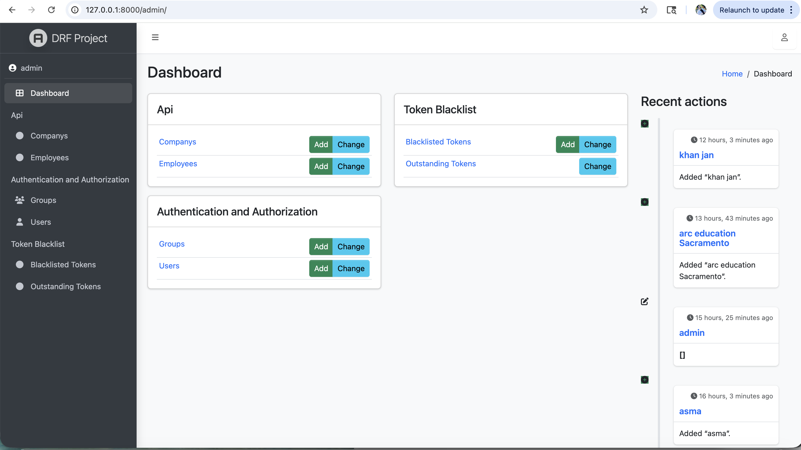
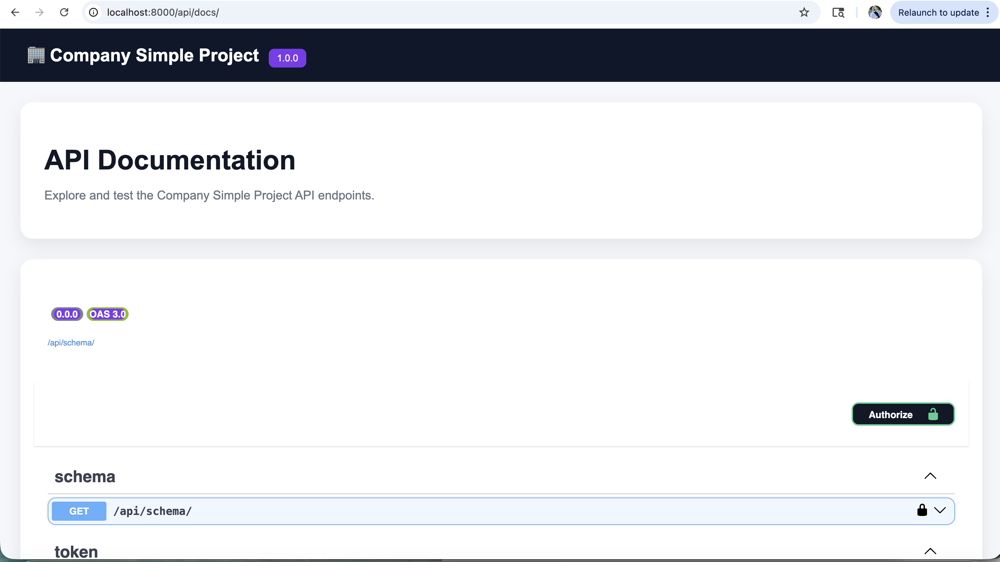

<h1 align="center">Company Simple Project</h1>

<p align="center">
Production-style Django REST Framework project with JWT authentication, PostgreSQL / SQLite support, split settings architecture, templates, and customized admin panel.
</p>

<p align="center">
  
  
  
  
  
  
</p>

<p align="center">
  <a href="#overview">Overview</a> •
  <a href="#features">Features</a> •
  <a href="#tech-stack">Tech Stack</a> •
  <a href="#project-structure">Structure</a> •
  <a href="#installation">Install</a> •
  <a href="#api-docs">API Docs</a> •
  <a href="#Screenshots">Screenshots</a>
</p>

---

## Overview

Company Simple Project is a professional Django REST Framework backend project built to demonstrate modern backend engineering practices including authentication, database flexibility, modular settings, templates, and admin customization.

---

## Features

- 🔐 JWT Authentication using SimpleJWT
- 🐘 PostgreSQL Support
- 💾 SQLite Support
- ⚙️ Split Settings (`base.py`, `dev.py`, `prod.py`)
- 📘 Swagger / OpenAPI Documentation
- 🏢 Companies Module
- 👨‍💼 Employees Module
- 🎨 Customized Django Admin Panel
- 🌐 HTML Templates
- 🔒 Environment Variables with `.env`
- 📂 GitHub Ready Structure

---

## Tech Stack

- Python
- Django
- Django REST Framework
- PostgreSQL
- SQLite
- SimpleJWT
- drf-spectacular
- django-filter
- Jazzmin Admin Theme

---

## Project Structure

```text
 ── api/
│   ├── admin/
│   ├── migrations/
│   ├── models/
│   ├── serializers/
│   ├── templates/
│   ├── tests/
│   ├── views/
│   └── urls.py
│
│── config/
│   ├── settings/
│   │   ├── base.py
│   │   ├── dev.py
│   │   └── prod.py
│   ├── urls.py
│   └── wsgi.py
│
│── .env.example
│── .gitignore
│── manage.py
│── requirements.txt
│── README.md
```

---

## Installation

```bash
git clone https://github.com/Sherullah-Mohtat/company-simple-project.git
cd company-simple-project

python -m venv venv

# macOS / Linux
source venv/bin/activate

# Windows
venv\Scripts\activate

pip install -r requirements.txt

cp .env.example .env

python manage.py migrate
python manage.py runserver
```

---

## Example .env

```env
DJANGO_SETTINGS_MODULE=config.settings.dev
DEBUG=True

SECRET_KEY=change-me

DB_ENGINE=sqlite
DB_NAME=db.sqlite3

# PostgreSQL Example
# DB_ENGINE=postgres
# DB_NAME=company_db
# DB_USER=postgres
# DB_PASSWORD=yourpassword
# DB_HOST=127.0.0.1
# DB_PORT=5432
```

---

## Run Project

```text
http://127.0.0.1:8000/
```

---

## API Docs

Swagger UI:

```text
http://127.0.0.1:8000/api/docs/
```

---

## 🔐 JWT Authentication Guide

Protected API endpoints require a token for create, update, or delete actions.

Current token settings:

- **Access Token Lifetime:** 30 minutes  
- **Refresh Token Lifetime:** 7 days  

---

## 1. Generate Tokens

Send `POST` request:

```text
http://127.0.0.1:8000/api/token/
```

---

Body:

```text
{
  "username": "your_username",
  "password": "your_password"
}
```

---

Response:

```text
{
  "refresh": "your_refresh_token",
  "access": "your_access_token"
}
```

---

# 2. Use Access Token

Use access token in protected requests:

```text
Authorization: Bearer your_access_token
```

Example:

```text
POST /api/v1/companies/
PUT /api/v1/companies/1/
DELETE /api/v1/companies/1/
```
# 3. Access Token Expiration

Access token expires after:

```text
30 minutes
```

After expiration, generate new access token using refresh token.

---

# 4. Refresh Token Usage

Send POST request:

```text
http://127.0.0.1:8000/api/token/refresh/
```

Body:

```text

{
  "refresh": "your_refresh_token"
}
```

Response:

If refresh token rotation is enabled, a new refresh token may also be returned.

---

# 5. Refresh Token Expiration

Refresh token expires after:

```text
7 days
```

After 7 days, login again using username/password.

---

# 6. Example Workflow

```text
Login once →
Get access token (30 min)
Get refresh token (7 days)

After 30 min →
Use refresh token

After 7 days →
Login again
```

---

# 7. Security Notes

* Never share tokens
* Store tokens securely
* Use HTTPS in production
* Rotate tokens regularly
  
---

## Screenshots














---

## Author

**Sherullah Mohtat**

https://github.com/Sherullah-Mohtat/company-simple-project.git

---

## License

MIT Licen
